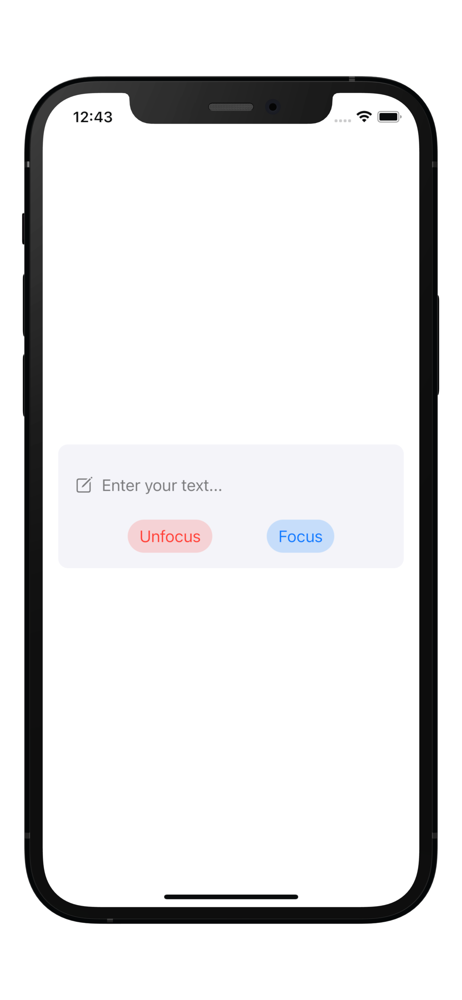
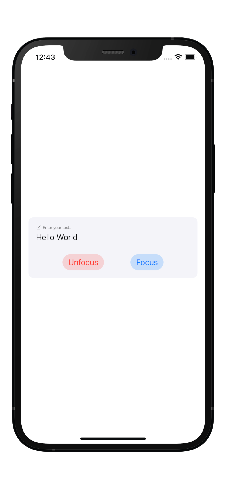

# FocusTextField

A TextField with a active label using the new Focus system on iOS 15

<p float="left">
  
  
</p>

### Usage

Usage is as simple as importing `FocusTextField`, declaring a `@State` `String` variable, and initializing `FocusTextField` with a placeholder.

```swift
@import FocusTextField

...

@State var text: String = ""

...

FocusTextField(text: $text) {
	Text("Placeholder")
}
```

### Customization

The style of the TextField, the Placeholder and the Active Placeholder are configured during initialization.

Other properties like `font`, the `placeholderSpacing` and the `activePlaceholderScale` are configured like view modifiers

```swift
FocusTextField(text: $text, textFieldStyle: Color.red) {
	Label("Enter Text", systemImage: "pencil.circle")
} activePlaceholder: {
	Label("Text", systemImage: "pencil.circle.fill")
		.foregroundStyle(Color.blue)
}
.textFieldFont(.body)
.placeholderSpacing(5)
.activePlaceholderScale(0.65)
```

### Features

 * Use any view as the placeholder
 * Use another view as the active placeholder
 * Set the placeholder scale
 * Set the placeholder spacing

### To Do

 * Move active placeholder to modifier, if possible
 * Move text field style to modifier, if possible
